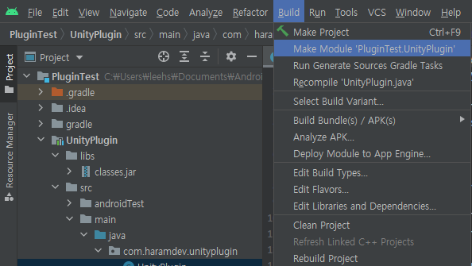

* toc
{:toc .large-only}


# 유니티와 안드로이드 연동

## 왜 유니티에서 안드로이드 코드가 필요할까요?

유니티에서 모바일 기기를 대상으로 하는 콘텐츠를 만들다보면 안드로이드의 네이티브 코드를 사용해야할 때가 종종 있습니다. 간단하게는 Toast를 띄운다던지, 파일 시스템에 접근한다던지, 공유하기 버튼을 만들어야 할 때도 있을 것입니다. 그럴 때 필요한 것이 안드로이드 네이티브 코드입니다. 그래서 유니티에서는 안드로이드 네이티브 코드를 사용할 수 있는 방법을 제공하고 있습니다.

> 저같은 경우는 미술관에서 Oculus Quest2를 통해 전시품과 관련된 애니메이션을 시청하는 콘텐츠를 제작했는데, 기기가 재부팅될 때 콘텐츠는 자동으로 시작되도록 했는데, 내부망으로만 동작하는 네트워크를 자동연결하지 않는 이슈가 있어서 콘텐츠에서 필요한 내부망 네트워크를 직접 연결할 수 있는 기능을 추가하기 위해 네이티브 코드를 사용하는 방법을 알아보게 되었습니다. 

## 유니티에서 안드로이드 코드를 사용하는 방법이 있나요?

유니티와 안드로이드를 연동하는 작업은 2단계로 나누어집니다. 

1. 안드로이드 네이티브 코드 작성 및 플러그인 생성.

2. 유니티에서 안드로이드 플러그인의 코드를 실행.

따라서 포스팅도 2개로 나누어집니다.

1. [유니티에서 안드로이드 코드쓰기 1 - AAR 만들기](#)
2. [유니티에서 안드로이드 코드쓰기 2 - 유니티에서 안드로이드 코드 사용하기 ](https://leehs27.github.io/programming/2021-08-17-UnityAndroid-2/){:target="_blank"}

<br/>

2020.3 버전을 기준으로, 유니티에서 안드로이드 네이티브 코드를 사용할 수 있는 방법은 3가지 입니다.

1. *.aar을 사용하는 방법
2. *.jar을 사용하는 방법
3. *.java 또는 *.kt 등 소스파일을 직접 사용하는 방법

3가지 방법 모두 장단점이 있습니다. 다만, 이 글에서는 제 개인적으로 편리하다고 생각하는 **[1. AAR을 이용하는 방법]**을 기준으로 설명하도록 하겠습니다.

### AAR 이란,

AAR은 **A**ndroid **AR**chive의 약자로, 안드로이드 Library용 압축 형태의 파일입니다. 자바에서 사용하는 JAR(Java Archive)와 유사하지만 소스코드 이외에, 사용된 리소스와 AndroidManifest 들이 포함됩니다.

실제로 빌드된 AAR 파일의 확장자를 .zip 으로 바뀐 뒤 압축을 풀어보면, 'AndroidManifest.xml', 'classes.jar', 'res/', 'R.txt' 등의 파일을 확인 할 수 있습니다.

{:.center}

AAR 압축을 풀었을 때 내용물
{:.figcaption}

## 안드로이드 프로젝트를 생성하자.

먼저 안드로이드 스튜디오를 켜줍니다.

{:.center}

새로운 프로젝트를 만들어주시는데, 저희는 라이브러리만 뽑을 것이니깐, **'No Activity'**를 선택해줍시다.

{:.center}

어차피 나중에 모듈을 따로 만들 것이라서 여기서 이름, 언어, SDK 등은 아무렇게나 해주시면 됩니다. 

{:.center}

Finish 버튼을 눌러주고, 프로젝트 생성이 마무리될 때까지 기다려줍니다. 

## 안드로이드 모듈을 만들자.

프로젝트가 모두 생성되면, **[File-New-New Module...]**을 눌러, 새로운 모듈을 추가해줍니다.

{:.center}

좌측탭에서 **안드로이드 라이브러리<sub>Android Library</sub>**를 선택해주시고, 적절한 모듈 이름을 지어줍니다. 저는 **'UnityPlugin'**이라 지어줬습니다. 이 이름을 나중에 유니티에서 사용하게 됩니다. 물론, 추후 변경도 가능합니다.  
언어도 자바나 코틀린 중 편한 것으로 선택해주시고, API 버전도 원하시는 기능과 타겟 기기에 따라서 설정해주시면 됩니다. 한가지 유의하실 것은 여기서 설정해준 API 버전을 추후 유니티에서도 동일하게 설정해주어야 하니 기억해주세요.

{:.center}

안드로이드 라이브러리 모듈 생성
{:.figcaption}

안드로이드에서도 유니티 클래스를 사용할 필요가 있으니, 유니티의 **classes.jar**파일을 찾아야합니다.

**[유니티 에디터 위치<sub>(C:\Program Files\Unity\Editor)</sub>\Data\PlaybackEngines/AndroidPlayer/Variations/mono 또는 il2cpp/Development 또는 Release/Classes/]**에서 찾을 수 있습니다.<sub>[[1]](https://docs.unity3d.com/2019.4/Documentation/Manual/AndroidUnityPlayerActivity.html){:target="_blank"}</sub>

찾은 **classes.jar**파일을 안드로이드 프로젝트에 넣어봅시다. 먼저 Project 뷰를 **Project**로 바꿔주시고, 방금 생성한 플러그인의 이름 하위에 **libs**폴더 안에 넣어줍니다.

{:.center}

classes.jar을 넣어야하는 위치
{:.figcaption}

**UnityPlugin**아래에 있는 **build.gradle**파일을 열어서 방금 추가한 **classes.jar**파일을 컴파일 하도록 옵션을 넣어줍니다.

`dependencies`아래에 `compileOnly fileTree(dir:'libs',includes: ['*.jar'])` 코드를 추가해줍니다. 그 후 상단에 **Sync Now**를 클릭해줍시다. 

> 수정하는 김에 `compileSdk`와 `targetSdk`의 값도 한번 확인하는 것이 좋습니다. 이 값도 추후에 [유니티에서 설정](https://leehs27.github.io/programming/2021-08-17-UnityAndroid-2/#빌드-세팅을-하자){:target="_blank"}해주어야하기 때문입니다.


Build.gradle 수정. 앱의 gradle이 아닌, 모듈의 gradle임을 꼭 확인하세요.
{:.figcaption}

## 코드를 적어보자.


이제 다시 Project 뷰를 **Android**로 바꿔주시고 자바 또는 코틀린 클래스를 생성해줍니다.

{:.center}

생성된 빈 클래스
{:.figcaption}

이제 생성된 클래스에 코드를 작성해봅시다.

```java
package com.haramdev.unityplugin;

import android.app.Activity;
import android.widget.Toast;

import com.unity3d.player.UnityPlayer;

public class UnityPlugin {

    private static UnityPlugin _instance;
    private static Activity _context;

    public static UnityPlugin getInstance() {
        if (_instance == null) {
            _instance = new UnityPlugin();
            _context = UnityPlayer.currentActivity;
        }
        return _instance;
    }

    public String getPackageName() {
        return _context.getPackageName();
    }

    public void showToast(String text) {
        _context.runOnUiThread(new Runnable() {
            @Override
            public void run() {
                Toast.makeText(_context, text, Toast.LENGTH_SHORT).show();
            }
        });
    }
}
```

이제 `showToast(String text)`함수를 통해 토스트 메세지를 띄울 수 있고, `getPackageName()`함수를 통해 콘텐츠의 패키지 이름을 받아올 수 있게 됩니다. 

당연히 여기에 예시 코드 이외에도 각자가 필요한 코드를 자유롭게 작성해주시면 됩니다. 

### Manifest를 확인하세요.

추가로 소스코드를 실행하는데 필요한 권한들이 있다면 지금 단계에서 **AndroidManifest.xml** 파일을 열어 추가하시면 됩니다.

## 마지막으로 AAR로 빌드하자.

이제 마지막으로 작성한 코드를 AAR 파일로 빌드하는 일만 남았습니다.

상단 메뉴에서 [**Build-Make Module**]을 눌러서 빌드를 해주시면 끝입니다.

{:.center}

모듈 빌드
{:.figcaption}

생성된 AAR 파일은 **[프로젝트 위치\PluginTest\UnityPlugin\build\outputs\aar]** 아래에서 찾을 수 있습니다. 

### 다음 글에서 계속됩니다.

생성한 AAR 파일을 유니티에 어떻게 넣는지, 함수는 어떻게 부르는지에 대해서 다음 글에서 이어서 알아보겠습니다.
