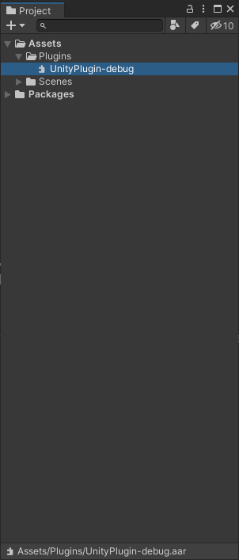
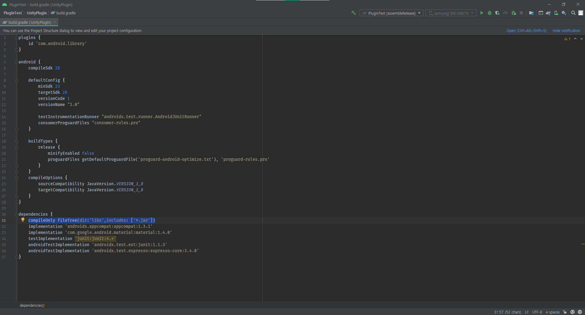
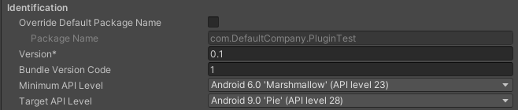

* toc
{:toc .large-only}
#### 유니티에서 안드로이드 코드쓰기 시리즈

1. [유니티에서 안드로이드 코드쓰기 1 - AAR 만들기](https://leehs27.github.io/programming/2021-08-09-UnityAndroid-1/){:target="_blank"}
2. [유니티에서 안드로이드 코드쓰기 2 - 유니티에서 안드로이드 코드 사용하기 ](#)(현재글)


# 튜토리얼 따라하기

## 유니티에 AAR 파일을 가져오자.

지난번 글의 마지막까지 따라오셨다면  **[프로젝트 위치\PluginTest\UnityPlugin\build\outputs\aar]** 아래에 UnityPlugin-debug.aar 또는 UnityPlugin-release.aar 파일이 생성된 것을 확인하실 수 있습니다.

그럼, 이제 안드로이드 코드가 필요한 유니티 프로젝트를 열어줍니다. 저는 샘플 프로젝트를 만들어주었습니다. 

유니티의 Project 뷰에서 **Plugins**라는 폴더를 생성해주고, 그 안에 aar 파일을 넣어줍니다.

{:.center}

>  Plugins폴더는 유니티의 예약 폴더 중에 하나였습니다. 2018.3 버전까지의 유니티 매뉴얼에는 Plugins 폴더가 포함되어 있었습니다.<sub>[[1]](https://docs.unity3d.com/2018.3/Documentation/Manual/SpecialFolders.html){:target="_blank"}</sub> 그런데 그 이후 버전부터는 해당 내용이 없어졌습니다.<sub>[[2]](https://docs.unity3d.com/Manual/SpecialFolders.html){:target="_blank"}</sub>  
>  시험삼아 Plugins 폴더가 아닌 곳에 넣어서 테스트해보니 문제없이 동작하는 것을 확인했습니다. 하지만 이전 버전과의 호환성을 위해서 모든 플러그인은 Plugins 폴더에 넣는 것을 권장합니다.

## AAR안에 들어있는 코드를 사용해보자.

이제 스크립트를 하나 만들어줍니다. 저는 `AndroidPlugin`이라는 이름의 스크립트를 하나 만들었습니다. 그리고 해당 클래스 안에 아래의 코드를 적어줍니다.

```c#
public class AndroidPlugin : MonoBehaviour
{
    void Start()
    {
        AndroidJavaClass unityPluginClass = new AndroidJavaClass("com.haramdev.unityplugin.UnityPlugin");
        AndroidJavaObject unityPlugin = unityPluginClass.CallStatic<AndroidJavaObject>("getInstance");
        
        unityPlugin.Call("showToast", unityPlugin.Call<string>("getPackageName"));
    }
}
```

그리고 씬에 오브젝트를 생성해서 해당 컴포넌트를 붙여주면 끝입니다.

## 빌드 세팅을 하자

마지막으로 빌드하기 전에, 안드로이드 버전을 맞춰주어야 합니다. 
**[Project Setting - Player - Other Settings - Identification - Minimum API Level / Target API Level]** 옵션을 세팅해야합니다. 각 값은 이전에 build.gradle 파일에 있는 `minSdk`값과 `targetSdk`값을 동일하게 입력해주어야 합니다.

{:.center}

{:.center}

 Minimum API Level과 Target API Level을 각각 23과 28로 동일하게 맞춘 것을 확인해주세요.
{:.figcaption}


그리고 빌드를 해서 실행해보면, 시작하자마자 해당 프로젝트의 패키지 이름을 토스트로 띄워주는 것을 확인하실 수 있습니다. 

{:.center}

# 코드 설명

### 예시 코드

먼저 사용된 2가지 코드를 같이 놓고 보면 이해가 쉬울 것 같습니다.

```java
package com.haramdev.unityplugin;

import ...

public class UnityPlugin {

    private static UnityPlugin _instance;
    private static Activity _context;

    public static UnityPlugin getInstance() {
        if (_instance == null) {
            _instance = new UnityPlugin();
            _context = UnityPlayer.currentActivity;
        }
        return _instance;
    }

    public String getPackageName() {
        return _context.getPackageName();
    }

    public void showToast(String text) {
        _context.runOnUiThread(new Runnable() {
            @Override
            public void run() {
                Toast.makeText(_context, text, Toast.LENGTH_SHORT).show();
            }
        });
    }
}
```

Android Java 코드
{:.figcaption}


```c#
public class AndroidPlugin : MonoBehaviour
{
    void Start()
    {
        AndroidJavaClass unityPluginClass = new AndroidJavaClass("com.haramdev.unityplugin.UnityPlugin");
        AndroidJavaObject unityPlugin = unityPluginClass.CallStatic<AndroidJavaObject>("getInstance");
        
        unityPlugin.Call("showToast", unityPlugin.Call<string>("getPackageName"));
    }
}
```
Unity C# 코드
{:.figcaption}


### `AndroidJavaClass`와 `AndroidJavaObject`

유니티에서 안드로이드 코드를 쓸 때, 가장 핵심이 되는 클래스가 2개 있는데, `AndroidJavaClass`와 `AndroidJavaObject`입니다.

먼저 **[`AndroidJavaClass`](https://docs.unity3d.com/ScriptReference/AndroidJavaClass.html){:target="_blank"}**는 안드로이드에서 구현된 클래스를 불러올 때 사용됩니다. 앞선 튜토리얼에서 `com.haramdev.unityplugin.UnityPlugin`클래스를 `AndroidJavaClass`를 이용해서 불러온 것 입니다.  

**[`AndroidJavaObject`](https://docs.unity3d.com/ScriptReference/AndroidJavaObject.html){:target="_blank"}**는 안드로이드에서 쓰이는 모든 오브젝트를 선언할 떄 사용됩니다. 예시에서는 싱글턴 패턴을 활용해서 `UnityPlugin` 클래스를 인스터스화하는데, 그렇게 인스턴스화된 객체를 `AndroidJavaObject`에 담게 됩니다.  

### `Call`과 `CallStatic`

그 다음으로 필요한 기능은 해당 클래스 또는 객체에서 함수를 부를 때 사용하는 `Call`과 `CallStatic`함수 입니다. 

**[`Call`](https://docs.unity3d.com/ScriptReference/AndroidJavaObject.Call.html){:target="_blank}**은 말그대로 자바로 선언된 메소드를 부르는 기능을 담당합니다.

`Call`을 사용할 때는, 첫번째 파라미터에는 함수의 이름을 적어주어야합니다. 두번째 파라미터에는 부르고자 하는 함수의 인자를 넣어주게 됩니다. 예시에서는 `showToast` 자바 메소드에는 `String`타입의 `text`라는 파라미터를 요구하는데, 그래서 유니티에서는 `Call("showToast", "text")`와 같은 모양으로 부르게 됩니다. 당연히 추가적인 파라미터를 요구하지 않는다면 안적으면 되구요.

`Call`은 기본 버전과 `Call<T>`로 되어있는 제너릭 버전으로 나누어져 있는데, 이는 리턴 타입에 따라 바뀌게 됩니다. 부르고자 하는 함수가 `void` 리턴 타입을 갖는 자바 메소드라면 기본 버전, `non-void` 리턴 타입을 갖는 자바 메소드라면 리턴 타입을 선언하는 제너릭 버전을 사용해야합니다. 

앞선 예시에서는 `showToast` 메소드는 리턴 타입이 없으니 `Call("showToast", "text")`와 같은 기본 모형으로 사용하지만, `getPackageName` 메소드는 `String`타입 리턴 값을 가지기 때문에 `Call<string>("getPackageName")`과 같이 사용해야합니다.

**[`CallStatic`](https://docs.unity3d.com/ScriptReference/AndroidJavaObject.CallStatic.html){:target="_blank"}**은 `Call`과 기본적인 부분은 동일하고, 단지 `Static`함수라는 차이점만 있습니다. `getInstance`라는 자바 메소드는 `static`으로 선언이 되어 있으니, `CallStatic("getInstance")`처럼 사용한 것을 확인하실 수 있습니다.

### `Get`과 `GetStatic`

예시에서는 사용하지 않았지만 `AndroidJavaClass`와 `AndroidJavaObject`에는 `Call`과 유사한 `Get`과 `GetStatic`함수가 존재합니다. `Call`이 자바 메소드를 부르는 함수라면 `Get`은 자바 필드값을 받아오는 함수입니다. 

사용방법은 `Call`과 매우 유사하며, 차이점은 파라미터가 없으니 함수 이름 이외에 추가적으로 넣어줄 인자가 없다는 점 정도가 되겠네요.

